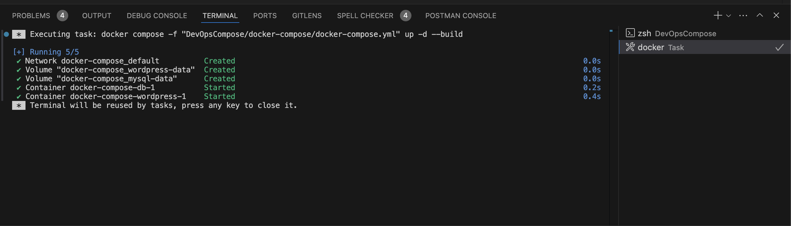
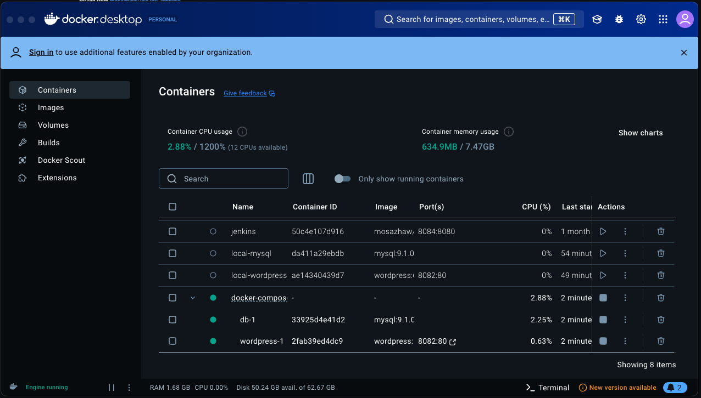
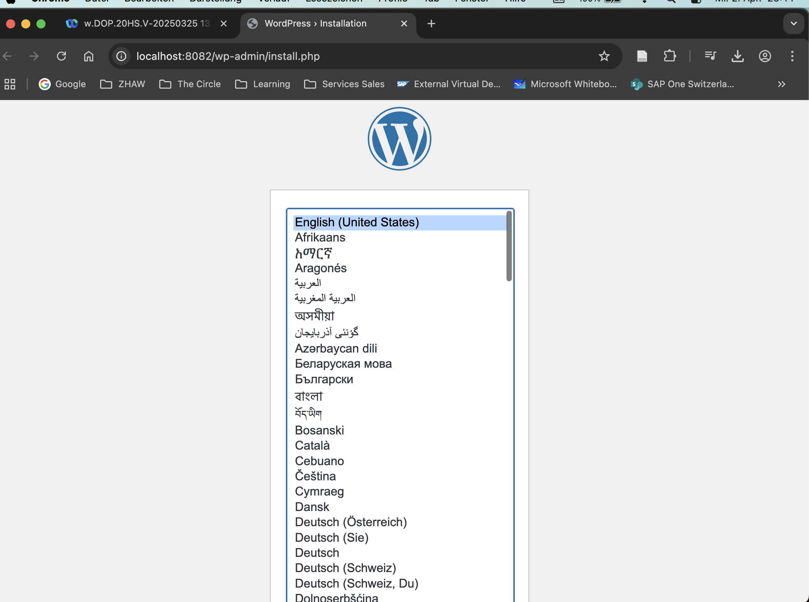
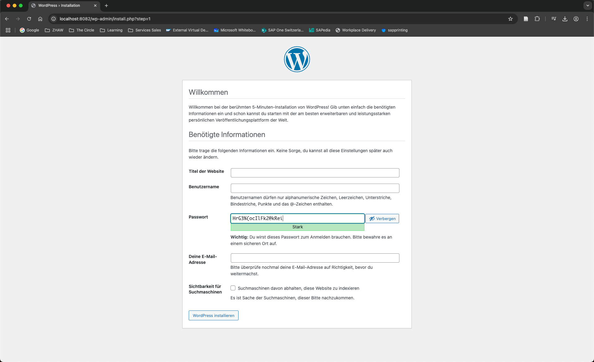

# DevOpsCompose
Nun ging es darum ein Docker Compose File zu erstellen/starten:

Wenn ich jetzt auf den Local Host Link klicke, öffnet sich folgendes Fenster: 

Ich weiss nicht, ob die Datenbank automatisch gefunden bzw. verbunden wurde. Adrian wollte ins Forum schreiben, bis dato (2. April) ist aber keine Nachricht eingetroffen. Nach Auswahl der Sprache erhalte ich folgende wordpress Seite: 

Weiter geht es mit der README unter DevOpsNodeWebApp: [https://github.com/islamgje/DevOpsNodeWebApp](README.md)